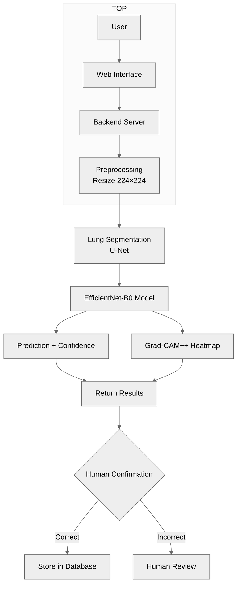

```mermaid
%%{init: {'theme':'base','themeVariables':{
  'primaryColor':'#eeeeee',
  'primaryBorderColor':'#666666',
  'primaryTextColor':'#000000',
  'lineColor':'#666666'
}}}%%

flowchart TB

subgraph TOP
direction LR
U[User] --> UI[Web Interface] --> API[Backend Server] --> PRE[Preprocessing<br/>Resize 224×224]
end

PRE --> SEG[Lung Segmentation<br/>U-Net]
SEG --> FE[EfficientNet-B0 Model]

FE --> OUT[Prediction + Confidence]
FE --> CAM[Grad-CAM++ Heatmap]

OUT --> RES[Return Results]
CAM --> RES

RES --> DOC{Human Confirmation}

DOC -->|Correct| DB[Store in Database]
DOC -->|Incorrect| REVIEW[Human Review]
```